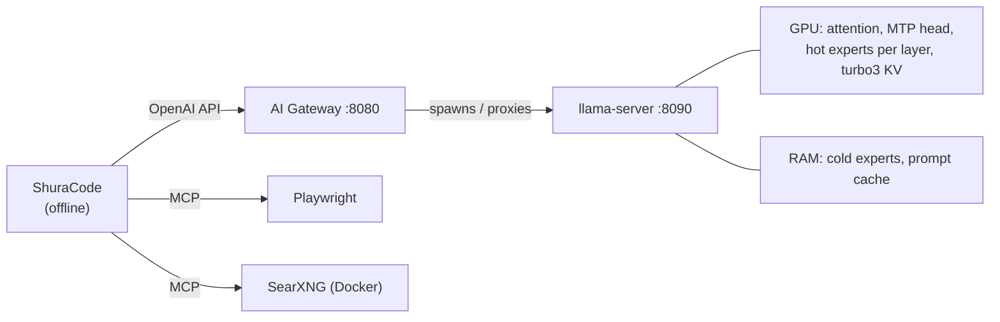

<div align="center">

<picture>
  <source media="(prefers-color-scheme: dark)" srcset="assets/logo-wordmark-dark.png">
  
</picture>

### A 35B coding model at 200k context on one 12 GB GPU, without taking over your desktop

[](LICENSE)


[](https://github.com/hikkian/shura/actions/workflows/ci.yml)

English · [Русский](README.ru.md)

</div>

---

> *Shura* (شورى) is Arabic for "consultation, council". In a Mixture-of-Experts model every token is
> decided by a council: a router consults 8 of 256 experts. This project is about seating that council
> on modest hardware.

## What is Shura

Mixture-of-Experts models like Qwen3.6-35B-A3B are a great fit for local coding: 35B parameters of
knowledge, but only ~3B are active per token. The catch is size. The model weighs **18 GB**, a good
consumer GPU has **12 GB**, and a coding agent wants **200k tokens of context** on top of that.

Shura is a tuned, measured and packaged setup that makes this work on a normal desktop PC:

- the **hot experts live in VRAM**, the rest in system RAM and are computed by the CPU at low priority;
- the **KV cache is compressed** (TurboQuant) so the freed VRAM goes to more hot experts;
- the **model's own MTP head** drafts tokens for speculative decoding (+32% decode);
- a small **gateway** loads the model on demand, keeps sessions in RAM and protects your SSD;
- **ShuraCode**, an offline coding agent, sits on top.

The goal is not a benchmark record. It is a coding assistant you can leave running while you keep
using the browser, the IDE, messengers and calls on the same machine.

| At a glance | |
|---|---|
| Model | [Tiel-Coder-35B-A3B-MTP](https://huggingface.co/peculiar-ragdoll/Tiel-Coder-35B-A3B-GGUF-MTP), `UD-IQ4_XS`, 18 GB |
| Hardware tested | RTX 4070 SUPER 12 GB · Ryzen 5 5600 · 32 GB DDR4-3200 · Fedora 44 (one machine) |
| Context | 200k window, benchmarked with **~187k tokens actually filled** |
| Decode speed at 187k | **38–39 tok/s** on a quiet desktop, **34–37** on a busy one ([details](#results)); ~50–54 up to 64k |
| Returning to a session | 1.9 s between sessions, ~13 s after a full model reload |
| Desktop latency while generating | p99 0.1–0.3 ms (idle: 0.1–0.5 ms) |
| Everything offline | inference, web search, browser automation |

> [!IMPORTANT]
> These numbers come from **one machine**. Other GPUs, CPUs and memory speeds will differ, and the
> setup needs re-tuning there. See [Tested environment and limits](#tested-environment-and-limits).

## What is new here

Most of the speed comes from other people's excellent work (credited below). This repository's own
contribution is finding what actually matters on a 12 GB card, making it reliable, and making it
coexist with a working desktop:

| | What | Why it matters |
|---|---|---|
| **Measured recipe** | A reproducible tuning path from stock llama.cpp (26.1 tok/s) to 38.3 tok/s at real 187k context, including every idea that failed | Most popular tricks did not transfer to 12 GB at 200k; the failures are documented too |
| **Decode-traced routing profile** | Which experts to keep in VRAM is decided from tokens *generated* in agent sessions, not from prompts | A profile built from long prompts is *worse* for decode than a tiny synthetic one |
| **Session continuity on hybrid models** | Persistent context checkpoints in slot save/restore (based on the upstream fix for [llama.cpp #25913](https://github.com/ggml-org/llama.cpp/issues/25913), plus an integrity hash) | After a model unload, a 187k session resumes by re-reading ~30 tokens instead of ~290 s (opt-in) |
| **SSD-wear-aware gateway** | Sessions stay in RAM; one file is written only when the model unloads | Saving after every response would write an estimated 135–640 GB/day |
| **Desktop-aware VRAM guard** | When free VRAM gets tight, the session is parked in RAM and the model yields to the desktop (opt-in) | The desktop's GPU memory is not constant (see [what we learned](#what-we-learned)) |
| **Hardware-aware installer** | Picks the quant that fits your RAM/VRAM from real GGUF headers, builds for your GPU, measures layouts | One command; written for Fedora, Ubuntu/Debian and Arch |
| **ShuraCode** | An offline agent with permanent memory, a read-only Plan mode and self-tested engine updates | Lives in [its own repository](https://github.com/hikkian/shuracode) |

> [!NOTE]
> **Built on other people's work.** [**thecodacus**](https://github.com/thecodacus) wrote the llama.cpp
> `perf` fork with the MoE expert cache and TurboQuant, and his benchmarks showed this was possible.
> **wilky2005** fixed TurboQuant for this model family. **peculiar-ragdoll** made Tiel-Coder.
> [**llama.cpp**](https://github.com/ggml-org/llama.cpp) is the foundation and
> [**OpenCode**](https://github.com/anomalyco/opencode) is the engine under ShuraCode.
> Full list: [Acknowledgements](#acknowledgements). What is ours and what is borrowed is stated in the
> table above and in [docs/ARCHITECTURE.md](docs/ARCHITECTURE.md).

## Results

Decode speed, **filled context** (restored from a saved slot before every run, median of 3–5 runs of
200 tokens), final configuration with 24 expert slots on a quiet desktop:

| Filled context | 4k | 16k | 32k | 64k | 128k | 187k |
|---|---:|---:|---:|---:|---:|---:|
| Decode tok/s | 53.9 | 53.2 | 50.8 | 49.4–51.5 | 42.4 | **38.6–39.2** |

How the speed was reached (mean decode tok/s over 5 requests at ~187k):

| Step | Mean tok/s |
|---|---:|
| Stock llama.cpp, default settings | 26.1 |
| + `--load-mode none` (no mmap) | 29.7 |
| + perf fork with the MoE expert cache (16 slots) | 35.9 |
| + patched TurboQuant `turbo3` KV, which leaves room for 24 slots | **38.3** |

The MTP head is on in all rows (~85% of drafts accepted). Every measurement, including the methodology
and the ideas that did not work, is in **[docs/BENCHMARKS.md](docs/BENCHMARKS.md)**.

| Session resume at 187k | Time |
|---|---:|
| Cold prefill | 264 s |
| Back to a session after other sessions (RAM prompt cache) | **1.9 s** |
| After a full model unload + reload (slot restored from disk) | **13 s** |
| …and the next prompt rewrites the previous turn, as agents do: without checkpoints | ~290 s (full re-read) |
| …the same with persistent checkpoints (opt-in) | **~1 s restore + ~30 new tokens** |

| Desktop impact while generating | |
|---|---:|
| UI scheduler latency p99 | 0.1–0.3 ms |
| Free RAM with a browser, IDE and messenger open | ~12.5 GB of 32 GB |
| CPU threads used by the model | 6 of 12, at lower priority |

> [!WARNING]
> **The caveat that matters: VRAM is shared with your desktop.** 24 expert slots take about 10.9 GB of
> the 12 GB card. On a desktop that also runs a browser, a messenger and a video call, free VRAM can drop
> below 150 MiB (the desktop's GPU memory moves by ±270 MiB; the lock screen alone takes ~350 MiB). On such a
> machine the stable setting today is **12–16 slots and 34–37 tok/s** at 187k. One busy CPU core costs
> another 6–7%. A cache that resizes itself at runtime is in development (see [Status](#status)).

## How it works



The experts of the first 26 layers stay in system RAM and the CPU computes the cold ones on 6 threads at
reduced priority; the most-routed ones stay in VRAM, chosen by the routing profile. The built-in MTP head
drafts one token ahead. TurboQuant shrinks the KV cache enough for 24 hot-expert slots instead of 16. The
gateway starts the model on demand, survives crashes, switches text/vision automatically and keeps session
state in RAM. Design and endpoints: **[docs/ARCHITECTURE.md](docs/ARCHITECTURE.md)**.

## What we learned

- **The expert cache is the biggest lever, and too many slots fail silently.** Oversubscribed VRAM does not
  raise an error, it slows down run over run, and a config can load fine and still run out of memory
  mid-generation at full context.
- **Prompt experts ≠ generation experts.** A routing profile must be traced from generated tokens.
- **TurboQuant is not a speedup by itself.** Its value is turning saved KV VRAM into more expert slots.
  It also needs [a fix](docs/TURBOQUANT-FIX.md) on head_dim-256 models, which otherwise crash or silently
  return wrong answers.
- **CPU threads beyond the physical cores add nothing.** The CPU side is memory-bandwidth bound.
- **Hybrid models need context checkpoints, and slot save/restore does not keep them.** Without them any
  change in the prompt prefix forces a full re-read.
- **The desktop is not constant.** Its GPU memory swings by hundreds of MiB (calls, video, the lock screen)
  and one busy CPU core costs 6–7% of decode speed. A fixed split cannot be both fast and safe.

<details>
<summary><b>Ideas that did not work here</b> (all measured)</summary>

All experts on CPU with a large expert cache · host-register and expert-prefetch env vars (they hurt with
the cache on) · larger `ubatch` · quantized MTP draft cache · a separate 100k "normal" profile with more
slots (not faster at equal depth) · more than 24 expert slots at 200k context (performance degrades). See
[docs/BENCHMARKS.md](docs/BENCHMARKS.md).

</details>

## Status

| Part | State |
|---|---|
| Tuned llama.cpp build, routing profile, gateway, installer, ShuraCode | **Works**; used by the author on the test machine |
| Persistent context checkpoints (`slotSaveCheckpoints`) | Implemented and accepted in tests; **opt-in**, off by default |
| VRAM guard (`vramGuard`): park the session in RAM under VRAM pressure | Implemented and accepted in tests; **opt-in**, off by default |
| Elastic expert cache that resizes itself at runtime | **In development.** A CUDA virtual-memory prototype can return VRAM to the card in milliseconds; quality validation is not finished and it is not part of a release |
| Universal planner (`shura check`, `shura report`, backend self-test) | Implemented and unit-tested on described machines; wiring into the installer is next |
| Faster attention at 187k | **Being investigated**: profiling shows attention takes about half of the GPU time at that depth |

## Quick start

On Fedora, Ubuntu/Debian or Arch with an NVIDIA GPU and its driver installed:

```bash
curl -fsSL https://raw.githubusercontent.com/hikkian/shura/main/setup.sh | bash
# or: git clone https://github.com/hikkian/shura.git && cd shura && ./setup.sh
```

The installer picks the Tiel-Coder quant that fits your RAM and VRAM (the planner supports 16 GB RAM),
builds llama.cpp for your GPU, measures a few layouts on your card and installs everything. It asks before
each `sudo` step. Options (`--quick`, `--quant`, `--model`, `--no-search`) and the list of everything it
changes: **[docs/INSTALLER.md](docs/INSTALLER.md)**. Manual setup: **[docs/INSTALL.md](docs/INSTALL.md)**.

## Daily use

Everything starts with the desktop session; nothing needs to be launched by hand.

- **App menu → Shura.** Pick a project folder and ShuraCode opens there in its own window. Right-click the
  icon for *Load model now* / *Unload model*. Works on any desktop with any common terminal
  (`SHURA_TERMINAL` chooses one).
- **Terminal:** `cd` into a project and type `shura`. The model starts loading in the background.

```
shura status    # model state, free RAM/VRAM, idle timer
shura warm      # load the model now          shura unload   # free RAM/VRAM now
shura off / on  # disable / enable the AI     shura logs     # follow logs
shura window    # new Shura window for the current folder
```

The model unloads itself after 30 idle minutes; the last long session is saved and restored on the next
start.

**ShuraCode** is the coding agent: permanent memory shared by all sessions, the commands `/remember`
`/forget` `/memory` `/test` `/commit`, a read-only **Plan** mode next to **Build** (Tab), and a live model
status in the footer. It is our customization layer on top of the OpenCode engine, in its own repository:
**[hikkian/shuracode](https://github.com/hikkian/shuracode)**; the installer sets it up.

## Run it on your hardware

Shura chooses the model and the settings from what your machine can do, not from its brand: how fast its memory
really is (measured), how much of it there is, what the GPU has, and which backend actually works. Three commands
need no install and no root, and send nothing anywhere:

```bash
# from a clone of this repository, nothing to install (`shura check` works the same once Shura is installed):
./scripts/shura check     # describes your machine and shows what Shura would pick, with a speed estimate
./scripts/shura report    # writes an anonymous report you can paste into a GitHub issue
python3 installer/universal/cli.py selftest --backend vulkan   # downloads one llama.cpp build and a 19 MB model, runs it
```

- **Classes by resources, not by device type:** a GPU with system RAM, unified memory (Apple), or a CPU-only machine.
  CPU-only does not mean small models: a many-channel server can run models no 12 GB card can hold.
- **Backends:** NVIDIA (CUDA, Vulkan), AMD (ROCm or Vulkan, whichever measures faster), Intel (SYCL, Vulkan, OpenVINO),
  Apple (Metal), or the CPU. The prebuilt llama.cpp builds are used, nothing is compiled on your machine.
- **Honest status:** the planner is implemented and unit-tested on described machines (AMD, Intel, Apple, dual-socket
  servers and more), but only NVIDIA on Linux has been verified on real hardware. The one-command installer
  (`setup.sh`) still targets NVIDIA on Linux; wiring the universal plan into it is the next step.

How the decision is made: **[docs/HARDWARE.md](docs/HARDWARE.md)**. To add your hardware, a model or a backend (a report
is enough): **[CONTRIBUTING-hardware.md](CONTRIBUTING-hardware.md)**.

## Tested environment and limits

> [!NOTE]
> Everything here was developed and tested on **one machine**. Anything outside this list is supported by
> design but **untested**. Reports and fixes are welcome.

| | Tested |
|---|---|
| OS | Fedora 44, kernel 7.2, x86_64 |
| Desktop | KDE Plasma on Wayland (earlier measurements: GNOME Shell 50) |
| Terminal | Ghostty 1.3 |
| GPU / driver | NVIDIA RTX 4070 SUPER 12 GB, driver 615.71 (RPM Fusion), CUDA 13.4 |
| CPU / RAM | AMD Ryzen 5 5600, 32 GB DDR4-3200 |
| Software | ShuraCode 0.1 (OpenCode 1.18 engine), Docker 29, Python 3.14, Node 24 |

**What this is not:**
- It is a 35B-A3B-class model at 4-bit. Expect a capable local coding assistant, not a frontier model.
- Linux and NVIDIA only. The expert cache and TurboQuant in the llama.cpp fork are written in CUDA.
- Not validated on other hardware: other distributions (the installer's package steps were checked in
  Ubuntu 24.04, Debian 12 and Arch containers only; a full fresh install has not been run there), XFCE and
  tiling WMs, GNOME since the switch to KDE, terminals other than Ghostty (dry-run only), the
  `kdialog`/`yad` dialogs, and GPUs other than a 12 GB card.

<details>
<summary><b>AMD and Intel GPUs: how to port Shura</b></summary>

AMD and Intel are not supported out of the box. You can port it yourself or with an AI coding agent
(ShuraCode can do this work too). Upstream llama.cpp already runs on AMD (ROCm/HIP, Vulkan) and Intel
(SYCL, Vulkan). Only two CUDA-specific features are missing:

1. **Works today, slower:** build upstream llama.cpp for your backend and use the same layout ideas: the
   first layers' experts in RAM (`--n-cpu-moe`), `q8_0`/`q4_0` KV cache and MTP. The gateway, ShuraCode and
   the rest of this repository do not depend on CUDA.
2. **Full speed:** port the fork's expert-cache and `turbo3` CUDA kernels. For AMD, llama.cpp already builds
   its CUDA backend through HIP, so the kernels may compile for ROCm with modest changes; the usual
   obstacles are the 64-wide wavefront and inline PTX. For Intel, rewrite them for SYCL or Vulkan. Then
   re-run the benchmarks in `bench/` and the correctness probes, because silent output corruption is the
   failure mode to watch for (see [docs/TURBOQUANT-FIX.md](docs/TURBOQUANT-FIX.md)).

Pull requests with measured results on non-NVIDIA cards are very welcome.

</details>

## Repository layout

```
setup.sh     one-command installer (distro packages, CUDA, build, model, auto-tune)
installer/   hardware planner, GGUF header reader, model download, auto-tune
tests/       installer and gateway unit tests + distro package test (containers)
gateway/     ai_gateway.py - on-demand llama-server manager + OpenAI-compatible proxy (stdlib only)
config/      example configs + agentic MoE routing profile for Tiel-Coder
patches/     TurboQuant head_dim-256 fix and persistent slot checkpoints for the perf fork
scripts/     shura (daily CLI), build-llama.sh, install.sh, capture-moe-trace.sh
desktop/     app-menu launcher template
assets/      logo (light/dark), app icons, social preview, source artwork
bench/       deep-context benchmark, depth sweep, session-cache test, correctness probes
systemd/     user service unit
searxng/     private SearXNG settings template
docs/        benchmarks, architecture, harness comparison, TurboQuant fix, install, troubleshooting
```

## Documentation

| | |
|---|---|
| [BENCHMARKS.md](docs/BENCHMARKS.md) | Every measurement: build tuning, MTP, threads, routing profiles, prefill, desktop impact, dead ends |
| [ARCHITECTURE.md](docs/ARCHITECTURE.md) | Gateway state machine, endpoints, KV cache and SSD-wear design |
| [TURBOQUANT-FIX.md](docs/TURBOQUANT-FIX.md) | Why TurboQuant crashes or corrupts output on this model family, and the fix |
| [HARNESS-COMPARISON.md](docs/HARNESS-COMPARISON.md) | OpenCode vs Pi vs Pithagoras vs DeepSeek Harness, tested hands-on |
| [INSTALLER.md](docs/INSTALLER.md) | What `setup.sh` does, how it picks the quant and tunes, what it changes, uninstall |
| [INSTALL.md](docs/INSTALL.md) | Manual step-by-step setup and tuning for other GPUs |
| [TROUBLESHOOTING.md](docs/TROUBLESHOOTING.md) | Known failure modes and their fixes |
| [SECURITY.md](SECURITY.md) | Threat model: localhost-only services, no auth, what not to expose |

## Acknowledgements

- [ggml-org/llama.cpp](https://github.com/ggml-org/llama.cpp) and the
  [thecodacus/llama.cpp](https://github.com/thecodacus/llama.cpp) `perf` fork (MoE expert cache, TurboQuant)
- **wilky2005** for the TurboQuant fix ([thecodacus/llama.cpp#12](https://github.com/thecodacus/llama.cpp/pull/12))
- The authors of the upstream fix for persistent context checkpoints
  ([llama.cpp #25913](https://github.com/ggml-org/llama.cpp/issues/25913),
  [PR #26004](https://github.com/ggml-org/llama.cpp/pull/26004)), which our implementation builds on
- [Tiel-Coder-35B-A3B-MTP](https://huggingface.co/peculiar-ragdoll/Tiel-Coder-35B-A3B-GGUF-MTP) by peculiar-ragdoll
- [OpenCode](https://github.com/anomalyco/opencode), [SearXNG](https://github.com/searxng/searxng),
  [Playwright MCP](https://github.com/microsoft/playwright-mcp)

## License

[MIT](LICENSE) for everything in this repository. The patches in `patches/` are derived from llama.cpp (MIT).
Model weights are not included and are covered by their own license.
