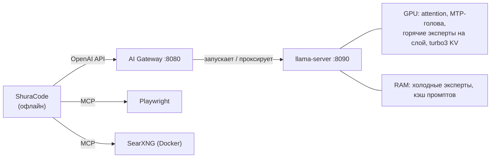

<div align="center">

<picture>
  <source media="(prefers-color-scheme: dark)" srcset="assets/logo-wordmark-dark.png">
  
</picture>

### 35B-модель для программирования с контекстом 200k на одной видеокарте 12 ГБ, и рабочий стол остаётся вашим

[](LICENSE)


[](https://github.com/hikkian/shura/actions/workflows/ci.yml)

[English](README.md) · Русский

</div>

---

> *Шура* (شورى) по-арабски значит "совет, совещание". В модели Mixture-of-Experts каждый токен решается
> советом: маршрутизатор советуется с 8 экспертами из 256. Этот проект о том, как собрать такой совет
> на скромном железе.

## Что такое Shura

MoE-модели вроде Qwen3.6-35B-A3B отлично подходят для локального программирования: знаний хватает на 35B
параметров, а на каждый токен работают всего ~3B. Подвох в размере. Модель весит **18 ГБ**, у хорошей
домашней видеокарты **12 ГБ**, а агенту для кода нужен **контекст в 200k токенов** сверху.

Shura — настроенная, измеренная и упакованная конфигурация, которая заставляет всё это работать на обычном
домашнем ПК:

- **горячие эксперты лежат в VRAM**, остальные в оперативной памяти, и их считает CPU с пониженным приоритетом;
- **KV-кэш сжат** (TurboQuant), а освободившаяся VRAM отдана под ещё больше горячих экспертов;
- **собственная MTP-голова модели** пишет черновики для спекулятивного декодирования (+32% к скорости);
- небольшой **gateway** загружает модель по требованию, держит сессии в RAM и бережёт SSD;
- сверху работает **ShuraCode**, офлайн-агент для программирования.

Цель не в рекорде на бенчмарке. Цель — помощник для кода, который можно оставить работать, пока вы продолжаете
пользоваться браузером, IDE, мессенджерами и звонками на том же компьютере.

| Коротко | |
|---|---|
| Модель | [Tiel-Coder-35B-A3B-MTP](https://huggingface.co/peculiar-ragdoll/Tiel-Coder-35B-A3B-GGUF-MTP), `UD-IQ4_XS`, 18 ГБ |
| Проверено на | RTX 4070 SUPER 12 ГБ · Ryzen 5 5600 · 32 ГБ DDR4-3200 · Fedora 44 (одна машина) |
| Контекст | окно 200k, замеры с **~187k реально заполненных токенов** |
| Скорость генерации на 187k | **38–39 ток/с** на спокойном рабочем столе, **34–37** на загруженном ([подробности](#результаты)); ~50–54 до 64k |
| Возврат к сессии | 1.9 с между сессиями, ~13 с после полной перезагрузки модели |
| Задержка интерфейса при генерации | p99 0.1–0.3 мс (в простое: 0.1–0.5 мс) |
| Всё офлайн | инференс, веб-поиск, управление браузером |

> [!IMPORTANT]
> Эти цифры получены на **одной машине**. На других видеокартах, процессорах и скоростях памяти результаты
> будут другими, и настройку придётся подбирать заново. См. [Проверенное окружение и ограничения](#проверенное-окружение-и-ограничения).

## Что здесь нового

Большая часть скорости — заслуга чужой отличной работы (она перечислена ниже). Собственный вклад этого
репозитория: выяснить, что на самом деле важно на карте 12 ГБ, сделать это надёжным и научить уживаться с
рабочим столом:

| | Что | Зачем |
|---|---|---|
| **Измеренный рецепт** | Повторяемый путь настройки от обычного llama.cpp (26.1 ток/с) до 38.3 ток/с на реальном контексте 187k, включая все идеи, которые не сработали | Большинство популярных трюков не переносится на 12 ГБ с контекстом 200k; провалы тоже описаны |
| **Профиль маршрутизации по сгенерированным токенам** | Какие эксперты держать в VRAM, решается по токенам, *сгенерированным* в агентных сессиях, а не по промптам | Профиль по длинным промптам для генерации *хуже* крошечного синтетического |
| **Непрерывность сессии на гибридных моделях** | Сохранение контрольных точек контекста при save/restore слота (на основе исправления [llama.cpp #25913](https://github.com/ggml-org/llama.cpp/issues/25913) плюс проверка целостности) | После выгрузки модели сессия на 187k возобновляется дочитыванием ~30 токенов вместо ~290 с (включается вручную) |
| **Gateway, бережёт SSD** | Сессии остаются в RAM; один файл пишется только при выгрузке модели | Сохранение после каждого ответа записывало бы, по оценке, 135–640 ГБ в день |
| **Страж VRAM, учитывающий рабочий стол** | Когда свободной VRAM мало, сессия убирается в RAM, а модель уступает место рабочему столу (включается вручную) | Видеопамять рабочего стола непостоянна (см. [что мы выяснили](#что-мы-выяснили)) |
| **Установщик с учётом железа** | Выбирает квант по вашим RAM/VRAM из настоящих заголовков GGUF, собирает под вашу карту, замеряет раскладки | Одна команда; написан для Fedora, Ubuntu/Debian и Arch |
| **ShuraCode** | Офлайн-агент с постоянной памятью, режимом Plan только для чтения и обновлениями движка с самопроверкой | Живёт в [отдельном репозитории](https://github.com/hikkian/shuracode) |

> [!NOTE]
> **Проект построен на чужой работе.** [**thecodacus**](https://github.com/thecodacus) написал `perf`-форк llama.cpp
> с кэшем MoE-экспертов и TurboQuant, а его бенчмарки показали, что это возможно. **wilky2005** исправил
> TurboQuant для этого семейства моделей. **peculiar-ragdoll** сделал Tiel-Coder.
> [**llama.cpp**](https://github.com/ggml-org/llama.cpp) — фундамент, а [**OpenCode**](https://github.com/anomalyco/opencode) —
> движок под ShuraCode. Полный список: [Благодарности](#благодарности). Что наше, а что заимствовано,
> сказано в таблице выше и в [docs/ARCHITECTURE.md](docs/ARCHITECTURE.md).

## Результаты

Скорость генерации на **заполненном контексте** (перед каждым запуском восстанавливается сохранённый слот,
медиана 3–5 запусков по 200 токенов), финальная конфигурация с 24 слотами экспертов на спокойном рабочем столе:

| Заполненный контекст | 4k | 16k | 32k | 64k | 128k | 187k |
|---|---:|---:|---:|---:|---:|---:|
| Генерация, ток/с | 53.9 | 53.2 | 50.8 | 49.4–51.5 | 42.4 | **38.6–39.2** |

Как достигнута скорость (среднее по 5 запросам на ~187k):

| Шаг | Среднее, ток/с |
|---|---:|
| Обычный llama.cpp, настройки по умолчанию | 26.1 |
| + `--load-mode none` (без mmap) | 29.7 |
| + perf-форк с кэшем MoE-экспертов (16 слотов) | 35.9 |
| + исправленный TurboQuant `turbo3` для KV, что даёт место под 24 слота | **38.3** |

MTP-голова включена во всех строках (принимается ~85% черновиков). Все замеры, включая методику и идеи,
которые не сработали, собраны в **[docs/BENCHMARKS.md](docs/BENCHMARKS.md)**.

| Возврат к сессии на 187k | Время |
|---|---:|
| Холодный prefill | 264 с |
| Возврат после работы в других сессиях (кэш промптов в RAM) | **1.9 с** |
| После полной выгрузки и загрузки модели (слот восстановлен с диска) | **13 с** |
| …и следующий промпт переписывает прошлый ход, как делают агенты: без контрольных точек | ~290 с (полный пересчёт) |
| …то же с сохранёнными контрольными точками (включается вручную) | **~1 с на восстановление + ~30 новых токенов** |

| Влияние на рабочий стол при генерации | |
|---|---:|
| Задержка планировщика интерфейса, p99 | 0.1–0.3 мс |
| Свободная RAM при открытых браузере, IDE и мессенджере | ~12.5 ГБ из 32 ГБ |
| Потоков CPU у модели | 6 из 12, с пониженным приоритетом |

> [!WARNING]
> **Главная оговорка: VRAM делится с рабочим столом.** 24 слота экспертов занимают около 10.9 ГБ из 12 ГБ карты.
> Если на компьютере открыты браузер, мессенджер и идёт видеозвонок, свободной видеопамяти может остаться меньше
> 150 МиБ (видеопамять рабочего стола колеблется на ±270 МиБ, один лишь экран блокировки занимает ~350 МиБ).
> Поэтому на такой машине сейчас устойчивая настройка — **12–16 слотов и 34–37 ток/с** на 187k. Одно занятое ядро
> CPU съедает ещё 6–7%. Кэш, который сам меняет размер на ходу, находится в разработке (см. [Статус](#статус)).

## Как это устроено



Эксперты первых 26 слоёв лежат в оперативной памяти, а холодных считает CPU в 6 потоков с пониженным
приоритетом; самые востребованные остаются в видеопамяти, их выбирает профиль маршрутизации. Встроенная MTP-голова
пишет черновик на токен вперёд. TurboQuant сжимает KV-кэш настолько, что помещается 24 слота горячих экспертов вместо
16. Gateway запускает модель по требованию, переживает падения, сам переключает текстовый и vision-режим и держит
состояние сессий в RAM. Устройство и эндпоинты: **[docs/ARCHITECTURE.md](docs/ARCHITECTURE.md)**.

## Что мы выяснили

- **Кэш экспертов — главный рычаг, но слишком много слотов вредит незаметно.** Переполнение VRAM не выдаёт
  ошибку, а постепенно замедляет работу, и конфиг может нормально загрузиться и всё равно упасть по памяти посреди
  генерации на полном контексте.
- **При чтении промпта и при генерации работают разные эксперты.** Профиль маршрутизации нужно снимать со
  сгенерированных токенов.
- **TurboQuant сам по себе не ускоряет генерацию.** Его ценность в том, что сэкономленная VRAM KV-кэша уходит
  под дополнительные слоты экспертов. К тому же на моделях с head_dim 256 он требует
  [исправления](docs/TURBOQUANT-FIX.md): без него сервер падает или молча выдаёт неверные ответы.
- **Потоки CPU сверх числа физических ядер ничего не дают.** Расчёт на CPU упирается в пропускную способность памяти.
- **Гибридным моделям нужны контрольные точки контекста, а сохранение слота их не хранит.** Без них любое
  изменение начала промпта заставляет пересчитывать контекст целиком.
- **Рабочий стол не постоянен.** Его видеопамять колеблется на сотни МиБ (звонки, видео, экран блокировки), а одно
  занятое ядро CPU стоит 6–7% скорости. Фиксированная раскладка не может быть и быстрой, и безопасной одновременно.

<details>
<summary><b>Идеи, которые здесь не сработали</b> (все замерены)</summary>

Все эксперты на CPU с большим кэшем · флаги host-register и prefetch экспертов (с включённым кэшем они вредят) ·
увеличенный `ubatch` · сжатый черновой кэш MTP · отдельный «обычный» профиль на 100k с большим числом слотов (на
той же глубине не быстрее) · больше 24 слотов экспертов при контексте 200k (скорость падает). См.
[docs/BENCHMARKS.md](docs/BENCHMARKS.md).

</details>

## Статус

| Часть | Состояние |
|---|---|
| Настроенная сборка llama.cpp, профиль маршрутизации, gateway, установщик, ShuraCode | **Работает**; автор пользуется на тестовой машине |
| Сохранение контрольных точек контекста (`slotSaveCheckpoints`) | Реализовано и принято в тестах; **включается вручную**, по умолчанию выключено |
| Страж VRAM (`vramGuard`): убирает сессию в RAM при нехватке видеопамяти | Реализовано и принято в тестах; **включается вручную**, по умолчанию выключено |
| Эластичный кэш экспертов, который сам меняет размер на ходу | **В разработке.** Прототип на виртуальной памяти CUDA возвращает VRAM карте за миллисекунды; проверка качества не закончена, в релиз не входит |
| Универсальный установщик (`shura install`) для AMD, Intel, Apple, Windows и машин без GPU | **Экспериментально, на таком железе ещё не запускался.** Проверен модульными тестами и на поддельных серверах; см. [что проверено](#что-проверено-и-что-нет) |
| Быстрее внимание на 187k (`scripts/build-llama.sh --attention-decode`) | Реализовано и принято в тестах на машине автора; **включается вручную**, по умолчанию выключено. На 187k ядро внимания быстрее на 17%, генерация примерно на 5%, качество не изменилось (см. [BENCHMARKS](docs/BENCHMARKS.md)) |

## Быстрый старт

На Fedora, Ubuntu/Debian или Arch с видеокартой NVIDIA и установленным драйвером:

```bash
curl -fsSL https://raw.githubusercontent.com/hikkian/shura/main/setup.sh | bash
# или: git clone https://github.com/hikkian/shura.git && cd shura && ./setup.sh
```

Установщик выбирает квант Tiel-Coder под ваши RAM и VRAM (планировщик поддерживает 16 ГБ RAM), собирает llama.cpp
под вашу видеокарту, замеряет несколько раскладок на вашей карте и устанавливает всё необходимое. Перед каждым
шагом с `sudo` он спрашивает разрешения. Параметры (`--quick`, `--quant`, `--model`, `--no-search`) и список всего,
что он меняет: **[docs/INSTALLER.md](docs/INSTALLER.md)**. Ручная установка: **[docs/INSTALL.md](docs/INSTALL.md)**.

## Ежедневное использование

Всё стартует вместе с сессией рабочего стола, вручную ничего запускать не нужно.

- **Меню приложений → Shura.** Выберите папку проекта, и ShuraCode откроется в ней в своём окне. По правой кнопке
  на значке доступны *Загрузить модель сейчас* / *Выгрузить модель*. Работает в любом окружении и с любым
  популярным терминалом (нужный можно задать через `SHURA_TERMINAL`).
- **Терминал:** перейдите в проект и введите `shura`. Модель начнёт загружаться в фоне.

```
shura status    # состояние модели, свободные RAM/VRAM, таймер простоя
shura warm      # загрузить модель сейчас     shura unload   # освободить RAM/VRAM сейчас
shura off / on  # отключить / включить ИИ     shura logs     # смотреть логи
shura window    # новое окно Shura для текущей папки
```

Модель сама выгружается после 30 минут простоя; последняя длинная сессия сохраняется и восстанавливается при
следующем запуске.

**ShuraCode** — агент для программирования: постоянная память, общая для всех сессий, команды `/remember` `/forget`
`/memory` `/test` `/commit`, режим **Plan** только для чтения рядом с **Build** (Tab) и живой статус модели в
подвале. Это наша надстройка над движком OpenCode в отдельном репозитории:
**[hikkian/shuracode](https://github.com/hikkian/shuracode)**; установщик настраивает его сам.

## Запуск на своём железе

Shura выбирает модель и настройки по тому, что умеет ваш компьютер, а не по марке: насколько быстра его память
(она измеряется), сколько её, что есть у видеокарты и какой бэкенд реально работает.

```bash
git clone https://github.com/hikkian/shura && cd shura
./scripts/shura check             # что потянет ваш компьютер и как быстро (ничего не ставит и не отправляет)
./scripts/shura install --dry-run # что скачается и сколько нужно места (ничего не скачивает)
./scripts/shura install           # скачать, проверить и настроить; затем `shura start` / `shura stop`
./scripts/shura report --issue    # обезличенный отчёт для issue на GitHub: помогает всем с таким же железом
```

В Windows используйте `scripts\shura.cmd` (или `py installer\universal\cli.py`). Windows не может измерить скорость ОЗУ без компилятора: добавьте `--ram-gbs 40` (две планки DDR4-3200; для DDR5-6000 около 80). NVIDIA на Linux получает быстрый уровень
(наш CUDA-форк) через `setup.sh`, `shura install` подскажет. Все остальные машины `shura install` устанавливает сам, ничего
не компилируя и без root.

`shura install` сделан так, чтобы неудачный день ничего не стоил: он спрашивает перед скачиванием; сначала проверяет
свободное место; оборванная загрузка **докачивается**; каждый файл проверяется (размер и SHA-256); он запускает настоящий
сервер с выбранными настройками и **доказывает**, что они работают; если не хватило памяти, план пересчитывается с большим
запасом и запуск повторяется; а если ничего не сработало, остаётся обезличенный отчёт, а скачанное сохраняется, чтобы
следующий запуск не начинал с нуля. `shura uninstall` удаляет всё, что поставил.

> [!NOTE]
> Там, где это возможно (Vulkan на Linux, Metal на Apple Silicon, CUDA на Windows с NVIDIA), `shura install` также пробует
> **сторонний** форк llama.cpp с турбо-кэшем, кэшем экспертов и MTP
> ([TheTom/llama-cpp-turboquant](https://github.com/TheTom/llama-cpp-turboquant), закреплённый релиз, архив сверяется с SHA-256,
> записанным в этом репозитории). Он замеряется против обычного llama.cpp на вашей машине, и остаётся более быстрый.
> `shura install --no-turbo` его не использует.

- **Классы по ресурсам, а не по типу устройства:** видеокарта с оперативной памятью, единая память (Apple) или только
  процессор. «Только процессор» не значит «маленькие модели»: многоканальный сервер потянет модели, которые не
  помещаются в карту на 12 ГБ.
- **Бэкенды:** NVIDIA (CUDA, Vulkan), AMD (ROCm или Vulkan, смотря что быстрее по замеру), Intel (SYCL, Vulkan,
  OpenVINO), Apple (Metal) или CPU. Берутся готовые сборки llama.cpp, на вашем компьютере ничего не компилируется.

### Что проверено, а что нет

> [!WARNING]
> **Настоящий запуск Shura был только на одной машине** (RTX 4070 SUPER 12 ГБ, Ryzen 5 5600, 32 ГБ DDR4, Fedora 44).
> Всё остальное ниже написано, проверено программно и, по нашему мнению, должно работать, но **на таком железе пока никто
> не запускал**. Вы можете оказаться первым, и ваш результат — самое полезное, что можно прислать.

| Ваша машина | Как ставится | Состояние |
|---|---|---|
| NVIDIA, Linux, 12 ГБ VRAM + 32 ГБ RAM | `setup.sh` (наш CUDA-форк) | **Проверено** на машине автора |
| NVIDIA, Linux, другие размеры (8, 16, 24 ГБ; 16 ГБ RAM) | `setup.sh` | **Не проверено.** План считается по модели, подогнанной под одну машину |
| AMD (ROCm или Vulkan), Intel (SYCL, Vulkan, OpenVINO) | `shura install` | **Не проверено на настоящих GPU** |
| Apple Silicon (Metal) | `shura install` | **Не проверено** |
| Windows (любая GPU или процессор) | `shura install` | **Не проверено**; только модульные тесты и CI |
| Только процессор, включая многоканальные серверы | `shura install` | **Не проверено**; предсказания скорости здесь самые неуверенные |

Что проверяется автоматически при каждом коммите (CI): модульные тесты на Linux, macOS и Windows; настоящая сборка
llama.cpp скачивается и запускается на модели в 19 МБ (CPU-сборка на Linux и Windows, сборка Metal на macOS внутри виртуальной машины CI); Vulkan-сборка запускается на программном
драйвере (экспериментально); флаги, которые `shura install` передаёт `llama-server`, сверены с настоящим `--help`
закреплённого релиза (b11301).

Чего **не проверял никто**: настоящую видеокарту, кроме авторской; загрузку настоящей модели в 17 ГБ на другом железе;
предсказания скорости (это оценки, подогнанные под одну машину, они показываются диапазоном, а план проверяется настоящим
запуском сервера); запуск и остановку сервера в Windows; загрузку дольше 15 минут (установщик перестаёт ждать).

### Помогите проверить

1. `./scripts/shura check` и посмотрите план: похож ли он на правду для вашей машины?
2. `./scripts/shura install --dry-run`, затем `./scripts/shura install`.
3. Откройте issue **[Hardware report](https://github.com/hikkian/shura/issues/new?template=hardware_report.md)**, чем бы
   всё ни кончилось. `./scripts/shura report --issue` печатает готовую ссылку; в отчёте нет имён, путей и идентификаторов,
   и ничего не уходит, пока вы сами не нажмёте кнопку на GitHub.
   - **Сработало:** напишите реальную скорость (токенов/с) и размер контекста. В отчёте уже есть то, что мы предсказали;
     разница между ними это то, как исправляются предсказания.
   - **Не сработало:** приложите `logs/verify.log` из папки Shura (`~/.local/share/shura`, `~/Library/Application
     Support/shura` или `%LOCALAPPDATA%\shura`) и напишите, где остановилось. Неудачная установка полезна не меньше удачной.
   - **Починили сами:** опишите, что было не так, и пришлите изменение.
4. Класс машин переходит из *не проверено* в *проверено* в таблице выше, когда приходит отчёт с настоящим замером.

Как принимается решение: **[docs/HARDWARE.md](docs/HARDWARE.md)**. Чтобы добавить своё железо, модель или бэкенд:
**[CONTRIBUTING-hardware.md](CONTRIBUTING-hardware.md)**.

## Проверенное окружение и ограничения

> [!NOTE]
> Всё здесь разработано и проверено на **одной машине**. Всё, что не входит в этот список, поддерживается по задумке,
> но **не тестировалось**. Отчёты и исправления приветствуются.

| | Проверено |
|---|---|
| ОС | Fedora 44, ядро 7.2, x86_64 |
| Окружение | KDE Plasma, Wayland (прежние замеры: GNOME Shell 50) |
| Терминал | Ghostty 1.3 |
| Видеокарта / драйвер | NVIDIA RTX 4070 SUPER 12 ГБ, драйвер 615.71 (RPM Fusion), CUDA 13.4 |
| CPU / RAM | AMD Ryzen 5 5600, 32 ГБ DDR4-3200 |
| ПО | ShuraCode 0.1 (движок OpenCode 1.18), Docker 29, Python 3.14, Node 24 |

**Чем это не является:**
- Это модель класса 35B-A3B в 4 битах. Ждите способного локального помощника для кода, а не модель уровня
  лучших закрытых систем.
- Только Linux и NVIDIA. Кэш экспертов и TurboQuant в форке llama.cpp написаны на CUDA.
- Не проверялось на другом железе: другие дистрибутивы (шаги установщика с пакетами проверены только в
  контейнерах Ubuntu 24.04, Debian 12 и Arch; полная установка с нуля там не запускалась), XFCE и тайловые WM,
  GNOME после перехода на KDE, терминалы кроме Ghostty (только сухой прогон), диалоги `kdialog`/`yad` и
  видеокарты, отличные от карты на 12 ГБ.

<details>
<summary><b>Видеокарты AMD и Intel: как портировать Shura</b></summary>

AMD и Intel из коробки не поддерживаются. Портировать можно самостоятельно или с помощью ИИ-агента для
программирования (ShuraCode тоже с этим справится). Обычный llama.cpp уже работает на AMD (ROCm/HIP, Vulkan) и
Intel (SYCL, Vulkan). Не хватает только двух функций, написанных под CUDA:

1. **Работает уже сейчас, но медленнее:** соберите обычный llama.cpp под свой бэкенд и используйте те же идеи
   раскладки: эксперты первых слоёв в RAM (`--n-cpu-moe`), KV-кэш `q8_0`/`q4_0` и MTP. Gateway, ShuraCode и всё
   остальное в этом репозитории от CUDA не зависят.
2. **Полная скорость:** перенесите CUDA-ядра кэша экспертов и `turbo3` из форка. Для AMD llama.cpp уже собирает
   свой CUDA-бэкенд через HIP, поэтому ядра могут собраться под ROCm с небольшими правками; обычные препятствия —
   wavefront шириной 64 и встроенный PTX. Для Intel ядра придётся переписать под SYCL или Vulkan. Затем
   перезапустите бенчмарки из `bench/` и проверки корректности, потому что главная опасность — тихая порча
   ответов (см. [docs/TURBOQUANT-FIX.md](docs/TURBOQUANT-FIX.md)).

Pull request'ы с измерениями на картах не от NVIDIA очень приветствуются.

</details>

## Структура репозитория

```
setup.sh     установщик одной командой (пакеты дистрибутива, CUDA, сборка, модель, автонастройка)
installer/   планировщик под железо, чтение заголовков GGUF, загрузка модели, автонастройка
tests/       тесты установщика и gateway + проверка пакетов дистрибутивов (контейнеры)
gateway/     ai_gateway.py — менеджер llama-server по требованию + OpenAI-совместимый прокси (только stdlib)
config/      примеры конфигов + агентный профиль маршрутизации MoE для Tiel-Coder
patches/     исправление TurboQuant для head_dim 256 и сохранение контрольных точек слота для perf-форка
scripts/     shura (ежедневный CLI), build-llama.sh, install.sh, capture-moe-trace.sh
desktop/     шаблон ярлыка для меню приложений
assets/      логотип (светлый/тёмный), значки приложения, превью для соцсетей, исходники
bench/       бенчмарк глубокого контекста, замеры по глубине, тест кэша сессий, проверки корректности
systemd/     пользовательский unit
searxng/     шаблон настроек приватного SearXNG
docs/        бенчмарки, архитектура, сравнение харнессов, исправление TurboQuant, установка, решение проблем
```

## Документация

| | |
|---|---|
| [BENCHMARKS.md](docs/BENCHMARKS.md) | Все замеры: настройка сборки, MTP, потоки, профили маршрутизации, prefill, влияние на рабочий стол, тупики |
| [ARCHITECTURE.md](docs/ARCHITECTURE.md) | Автомат состояний gateway, эндпоинты, устройство KV-кэша и защиты SSD |
| [TURBOQUANT-FIX.md](docs/TURBOQUANT-FIX.md) | Почему TurboQuant падает или портит ответы на этом семействе моделей, и как это исправлено |
| [HARNESS-COMPARISON.md](docs/HARNESS-COMPARISON.md) | OpenCode, Pi, Pithagoras и DeepSeek Harness — практическое сравнение |
| [INSTALLER.md](docs/INSTALLER.md) | Что делает `setup.sh`, как выбирает квант и настраивает, что меняет, как удалить |
| [INSTALL.md](docs/INSTALL.md) | Ручная установка по шагам и настройка под другое железо |
| [TROUBLESHOOTING.md](docs/TROUBLESHOOTING.md) | Известные проблемы и их решения |
| [SECURITY.md](SECURITY.md) | Модель угроз: сервисы только на localhost, без аутентификации, что нельзя выставлять наружу |

## Благодарности

- [ggml-org/llama.cpp](https://github.com/ggml-org/llama.cpp) и `perf`-форк
  [thecodacus/llama.cpp](https://github.com/thecodacus/llama.cpp) (кэш MoE-экспертов, TurboQuant)
- **wilky2005** за исправление TurboQuant ([thecodacus/llama.cpp#12](https://github.com/thecodacus/llama.cpp/pull/12))
- Авторы исправления сохранения контрольных точек контекста
  ([llama.cpp #25913](https://github.com/ggml-org/llama.cpp/issues/25913),
  [PR #26004](https://github.com/ggml-org/llama.cpp/pull/26004)), на котором основана наша реализация
- [Tiel-Coder-35B-A3B-MTP](https://huggingface.co/peculiar-ragdoll/Tiel-Coder-35B-A3B-GGUF-MTP) от peculiar-ragdoll
- [OpenCode](https://github.com/anomalyco/opencode), [SearXNG](https://github.com/searxng/searxng),
  [Playwright MCP](https://github.com/microsoft/playwright-mcp)

## Лицензия

Всё содержимое репозитория распространяется под [MIT](LICENSE). Патчи в `patches/` основаны на llama.cpp (MIT).
Веса модели в репозиторий не входят и распространяются под собственной лицензией.
