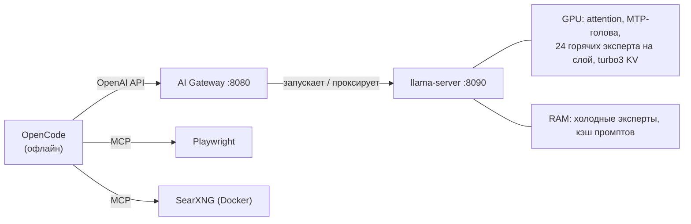

<div align="center">

<picture>
  <source media="(prefers-color-scheme: dark)" srcset="assets/logo-wordmark-dark.png">
  
</picture>

**Полностью локальная рабочая станция для программирования с ИИ: 35B MoE-модель с контекстом 200k на
одной видеокарте 12 ГБ, ~40 ток/с генерации — и рабочий стол при этом не тормозит.**

[](LICENSE)


[](https://github.com/hikkian/shura/actions/workflows/ci.yml)

[English](README.md) · Русский

</div>

---

> *Шура* (شورى) по-арабски значит "совет, совещание". В модели Mixture-of-Experts каждый токен решается
> советом: маршрутизатор советуется с 8 экспертами из 256. Этот проект о том, как собрать такой совет
> на скромном железе.

Репозиторий описывает и упаковывает рабочую конфигурацию для запуска
[Tiel-Coder-35B-A3B-MTP](https://huggingface.co/peculiar-ragdoll/Tiel-Coder-35B-A3B-GGUF-MTP)
(архитектура `qwen35moe`, 256 экспертов / 8 активных) как локального агента для кода. Модель весит
18 ГБ, а у видеокарты 12 ГБ. Всё работает офлайн: инференс, веб-поиск и управление браузером. Пока модель
работает, компьютером можно спокойно пользоваться: браузер, IDE, мессенджеры.

Что внутри:

- **рецепт сборки llama.cpp**, который поднял скорость генерации на реальном контексте 187k с 26 до ~40 ток/с;
- **исправление TurboQuant** (квантование KV-кэша) для моделей с head_dim 256 — без него сервер падает
  или молча выдаёт неверные ответы;
- **агентный профиль маршрутизации экспертов**, который решает, какие эксперты держать в VRAM. Он построен
  по сгенерированным токенам реалистичных агентных сессий;
- небольшой **AI Gateway**: загружает модель по требованию, сам переключает текстовый и vision-режим,
  переживает падения и держит состояние сессий в RAM, почти не нагружая SSD записью;
- **практическое сравнение четырёх агентных харнессов** и конфиг **OpenCode**, подготовленный для офлайн-работы;
- **скрипты бенчмарков** для каждой цифры ниже, включая идеи, которые не сработали.

## Результаты

Скорость генерации на **~187k токенах реального контекста**, RTX 4070 SUPER 12 ГБ + Ryzen 5 5600 + 32 ГБ DDR4:

| Конфигурация | Среднее, ток/с |
|---|---:|
| Стандартный llama.cpp, настройки по умолчанию | 26.1 |
| + `--load-mode none` (без mmap) | 29.7 |
| + perf-форк с кэшем MoE-экспертов (16 слотов) | 35.9 |
| + исправленный TurboQuant `turbo3` → место для 24 слотов экспертов | 38.3 |
| + черновик MTP длиной 1, 6 потоков с `nice 10`, агентный профиль экспертов | **~41.6**¹ |

¹ Замерено более быстрым методом с восстановлением слота: перед каждым запросом восстанавливается одна и та же
187k-сессия. Этим методом предыдущая строка даёт ~40.4, так что последний шаг — это около +3%. Оба метода описаны
в [docs/BENCHMARKS.md](docs/BENCHMARKS.md).

| Возврат к сессии на 187k | Время |
|---|---:|
| Холодный prefill | 264 с |
| Возврат после работы в других сессиях (кэш промптов в RAM) | **1.9 с** |
| После полной выгрузки и загрузки модели (слот восстановлен с диска) | **13 с** |

| Влияние на рабочий стол во время генерации | |
|---|---:|
| Задержка планировщика интерфейса, p99 (в простое: 0.1–0.5 мс) | 0.1–0.3 мс |
| Свободная RAM при открытых браузере, IDE и мессенджере | ~12.5 ГБ из 32 ГБ |
| Потоков CPU у модели | 6 из 12, с пониженным приоритетом |

## Как это устроено



Холодные эксперты первых 26 слоёв лежат в оперативной памяти, и их считает CPU в 6 потоков с пониженным
приоритетом. Самые востребованные эксперты этих слоёв держатся в видеопамяти, а какие именно — решает профиль
маршрутизации. Встроенная MTP-голова модели генерирует черновик на один токен вперёд для самоспекулятивного
декодирования (принимается ~85%, это +32% к скорости). TurboQuant сжимает KV-кэш настолько, что в VRAM
помещается 24 слота горячих экспертов вместо 16. Устройство Gateway описано в
**[docs/ARCHITECTURE.md](docs/ARCHITECTURE.md)**.

## Ключевые находки

- **Кэш экспертов — главный рычаг, но слишком много слотов вредит незаметно.** Переполнение VRAM не выдаёт
  ошибку, а постепенно замедляет работу. Конфиг может нормально загрузиться и всё равно упасть посреди
  генерации на полном контексте.
- **При чтении промпта и при генерации работают разные эксперты.** Профиль, собранный по длинным промптам
  (схемы инструментов, содержимое файлов), для генерации *хуже* крошечного синтетического. Профиль для скорости
  генерации нужно снимать только со сгенерированных токенов.
- **TurboQuant сам по себе не ускоряет генерацию.** Его ценность в том, что сэкономленная VRAM KV-кэша уходит
  под дополнительные слоты экспертов. К тому же на этом семействе моделей он требует
  [исправления](docs/TURBOQUANT-FIX.md).
- **Потоки CPU сверх числа физических ядер ничего не дают.** Расчёт на CPU упирается в пропускную способность
  памяти: 6, 8 и 10 потоков дают одинаковую скорость, а с меньшим числом потоков рабочий стол остаётся
  отзывчивым.
- **Многие популярные трюки не переносятся** на карту 12 ГБ с контекстом 200k: все эксперты на CPU с большим
  кэшем, флаги prefetch/host-register, увеличенный ubatch, сжатый черновой кэш MTP. Каждый из них замерен в
  [docs/BENCHMARKS.md](docs/BENCHMARKS.md).
- **Сохранять слоты на диск после каждого ответа** значило бы писать до ~640 ГБ в день при агентной работе.
  Gateway держит сессии в RAM и пишет один файл только при выгрузке модели.

## Быстрый старт

На Fedora, Ubuntu/Debian или Arch с видеокартой NVIDIA и установленным драйвером:

```bash
curl -fsSL https://raw.githubusercontent.com/hikkian/shura/main/setup.sh | bash
# или: git clone https://github.com/hikkian/shura.git && cd shura && ./setup.sh
```

Установщик сам выбирает квант Tiel-Coder под ваши RAM и VRAM (подходит и 16 ГБ RAM), собирает llama.cpp
под вашу видеокарту, замеряет несколько раскладок на ней и всё устанавливает. Перед каждым шагом с `sudo`
он спрашивает разрешение. Опции (`--quick`, `--quant`, `--model`, `--no-search`) и список того, что он
меняет в системе: **[docs/INSTALLER.md](docs/INSTALLER.md)**. Ручная установка:
**[docs/INSTALL.md](docs/INSTALL.md)** (оба документа на английском).

## Ежедневное использование

Всё поднимается вместе с сессией рабочего стола, вручную ничего запускать не нужно.

- **Меню приложений → Shura.** Выбираете папку проекта, и в ней открывается OpenCode в отдельном окне со значком
  Shura. Правый клик по значку: *Load model now* / *Unload model* — загрузить или выгрузить модель. Работает в любом
  окружении (GNOME, KDE, XFCE, тайловые WM) и с любым популярным терминалом; нужный можно задать через
  `SHURA_TERMINAL`.
- **Терминал:** перейдите в папку проекта и наберите `shura`. Модель начинает загружаться в фоне, пока
  открывается OpenCode, так что к первому вопросу она обычно уже готова.

```
shura status    # состояние модели, свободная RAM/VRAM, таймер простоя
shura warm      # загрузить модель сейчас          shura unload   # освободить RAM/VRAM сейчас
shura off / on  # выключить / включить ИИ          shura logs     # смотреть логи
shura window    # новое окно Shura для текущей папки
```

После 30 минут простоя модель выгружается сама. Последняя длинная сессия сохраняется и восстанавливается
при следующем запуске.

## Проверенное окружение

> [!NOTE]
> Всё в этом репозитории разработано и проверено на **одной машине**. Всё, что не входит в этот список,
> поддерживается по задумке, но **не тестировалось** — отчёты и исправления приветствуются.

| | Проверено |
|---|---|
| ОС | Fedora 44, ядро 7.2, x86_64 |
| Окружение | GNOME Shell 50, Wayland |
| Терминал | Ghostty 1.3 |
| Видеокарта / драйвер | NVIDIA RTX 4070 SUPER 12 ГБ, драйвер 615.71 (RPM Fusion), CUDA 13.4 |
| CPU / RAM | AMD Ryzen 5 5600, 32 ГБ DDR4-3200 |
| ПО | OpenCode 1.18, Docker 29, Python 3.14, Node 24 |

**Не проверялось на реальных системах:**
- другие дистрибутивы: шаги установщика с пакетами и репозиторием CUDA проверены только в контейнерах
  Ubuntu 24.04, Debian 12 и Arch; полная установка с нуля пока нигде больше не запускалась;
- KDE, XFCE и тайловые WM;
- терминалы кроме Ghostty: команды запуска для 11 других терминалов проверены только сухим прогоном;
- диалоги выбора папки `kdialog`/`yad`;
- другие видеокарты: все цифры выше относятся к карте на 12 ГБ, и на других картах настройки нужно подбирать
  заново (см. [docs/INSTALL.md](docs/INSTALL.md#tuning-for-other-hardware)).

Видеокарты AMD и Intel не поддерживаются: форк с кэшем экспертов работает только на CUDA.

## Документация

| | |
|---|---|
| [BENCHMARKS.md](docs/BENCHMARKS.md) | Все замеры: сборка, MTP, потоки, профили экспертов, prefill, влияние на рабочий стол, тупики |
| [ARCHITECTURE.md](docs/ARCHITECTURE.md) | Состояния Gateway, эндпоинты, KV-кэш и забота о ресурсе SSD |
| [TURBOQUANT-FIX.md](docs/TURBOQUANT-FIX.md) | Почему TurboQuant падает или портит ответы на этом семействе моделей и как это исправлено |
| [HARNESS-COMPARISON.md](docs/HARNESS-COMPARISON.md) | OpenCode, Pi, Pithagoras и DeepSeek Harness — практическое сравнение |
| [INSTALLER.md](docs/INSTALLER.md) | Что делает `setup.sh`, как выбирает квант и подбирает настройки, что меняет, удаление |
| [INSTALL.md](docs/INSTALL.md) | Ручная пошаговая установка и настройка под другие видеокарты |
| [TROUBLESHOOTING.md](docs/TROUBLESHOOTING.md) | Известные проблемы и их решения |
| [SECURITY.md](SECURITY.md) | Модель угроз: сервисы только на localhost, без авторизации, что нельзя открывать наружу |

Документация в `docs/` — на английском.

## Благодарности

- [ggml-org/llama.cpp](https://github.com/ggml-org/llama.cpp) и `perf`-форк
  [thecodacus/llama.cpp](https://github.com/thecodacus/llama.cpp) (кэш экспертов, TurboQuant)
- **wilky2005** за исправление TurboQuant ([thecodacus/llama.cpp#12](https://github.com/thecodacus/llama.cpp/pull/12))
- [Tiel-Coder-35B-A3B-MTP](https://huggingface.co/peculiar-ragdoll/Tiel-Coder-35B-A3B-GGUF-MTP) от peculiar-ragdoll
- [OpenCode](https://github.com/anomalyco/opencode), [SearXNG](https://github.com/searxng/searxng),
  [Playwright MCP](https://github.com/microsoft/playwright-mcp)

## Лицензия

Всё содержимое репозитория распространяется под [MIT](LICENSE). Патч в `patches/` основан на llama.cpp (MIT).
Веса модели не включены, на них действует собственная лицензия.
