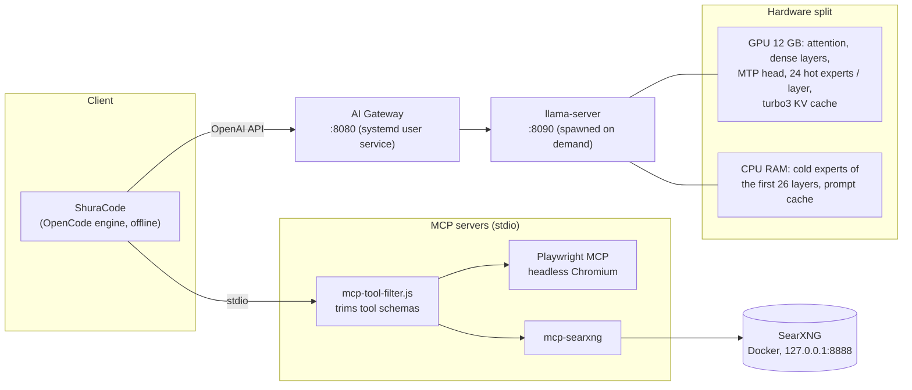
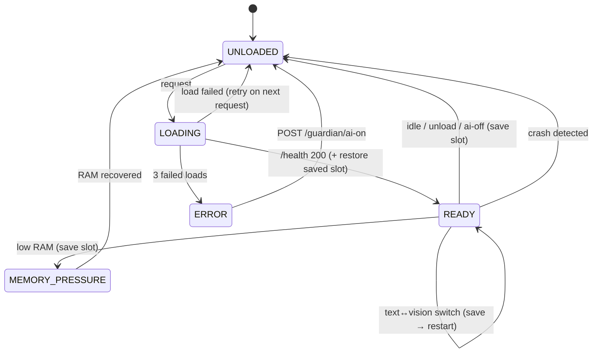

# Architecture

## Overview

## The gateway

[`gateway/ai_gateway.py`](../gateway/ai_gateway.py) is a standard-library-only Python reverse proxy.
It speaks the llama-server/OpenAI API on port 8080 and owns the llama-server process on port 8090.
It is a Linux rewrite of an earlier PowerShell "resource guardian".

| Responsibility | How |
|---|---|
| Load on demand | The first request starts llama-server and waits for `/health`; nothing uses RAM/VRAM until needed. |
| Text ↔ vision switching | The request body is inspected before forwarding. Any `image_url` / `"type": "image…"` part restarts the server with `--mmproj` and `visionOverrides` (fewer expert-cache slots to make room for the projector). |
| Idle unload | After `idleUnloadSeconds` (default 30 min) with no requests, the model is unloaded. |
| Memory-pressure guard | `MemAvailable` from `/proc/meminfo` below `ramFreeMinGB` for 3 polls unloads the model. A generation in flight is never interrupted. Reloading requires `ramFreeMinGBToLoad`, which stops load/unload thrashing. |
| Crash recovery | An unexpected exit is detected by the monitor thread; the next request reloads. Three failed loads in a row → `ERROR` until `ai-on`. |
| Agent compatibility | Rewrites the agent engine's camelCase `reasoningEffort` to `reasoning_effort`. Without this, the reasoning-effort variants (fast … max) are silently ignored by llama-server. |
| Streaming | Responses without `Content-Length` (SSE) are re-chunked and flushed as they arrive. Client disconnect closes the upstream socket, which aborts generation. |

### State machine

### Control endpoints

| Endpoint | Effect |
|---|---|
| `GET /guardian/status` | JSON: state, mode, RAM/VRAM headroom, idle time, last error |
| `POST /guardian/unload` | Save slot and unload now; the next request reloads |
| `POST /guardian/ai-off` · `ai-on` | Persistent manual disable / re-enable (also clears `ERROR`) |
| `POST /guardian/multimedia-lock` · `unlock` | Free the GPU for another job (e.g. Whisper) and block loads meanwhile |

Every other path is proxied to llama-server unchanged (including its web UI at `/`).

## KV cache and SSD wear

Re-prefilling a 187k-token session takes about 4.5 minutes, so reusing the KV state matters a lot for
agentic coding. The obvious approach is to dump the slot to disk after every response. That costs
~780 MB per save, and an agent session makes a request per tool call. Estimated against the SSD's
1,600 TBW rating:

| Strategy | Writes/day (heavy use) | Rated endurance consumed |
|---|---:|---|
| Save after every response (hundreds/day at 100-187k tokens) | 135-640 GB | full rating in ~7-30 years |
| Save only when switching sessions | 10-25 GB | negligible |
| **Keep in RAM, save only on model unload (this project)** | a few GB | negligible |

What this stack does:

1. **Session switching happens in RAM.** llama-server's host prompt cache (`--cache-ram 4096`) keeps
   the states of recent conversations; returning to a 187k session re-processes ~19 tokens (1.9 s).
   Context checkpoints (`--ctx-checkpoints`, default 32) let the hybrid Gated-DeltaNet model reuse a
   prefix even though its recurrent state cannot be rewound token by token.
2. **Disk is only touched on unload.** When the gateway unloads the model (idle, memory pressure,
   manual, shutdown), it saves slot 0 to `slotSaveDir`, and only if it holds at least
   `slotSaveMinTokens` (20k) tokens. Below that size, a fresh prefill takes seconds anyway.
3. **One file per mode, overwritten each time**, so disk usage is bounded (~0.8 GB). After the next
   load the gateway restores it automatically. If the next request continues that conversation, it
   resumes in ~13 s including model load; if not, the restore costs 0.2 s and is simply discarded.

Caveat: an *identical* repeated prompt cannot reuse a restored slot on this hybrid architecture
(the last token must be re-evaluated and the recurrent state cannot step back). A real continuation
of the conversation works as expected.

## MCP tool trimming

[`mcp/mcp-tool-filter.js`](../mcp/mcp-tool-filter.js) is a transparent stdio proxy that filters an MCP
server's `tools/list` response against an allowlist before the client sees it. Every tool schema sits
in the system prompt of every request, so trimming Playwright from 25 to 14 tools and SearXNG from
4 to 2 saves ~2,850 tokens of prefill per fresh session.
