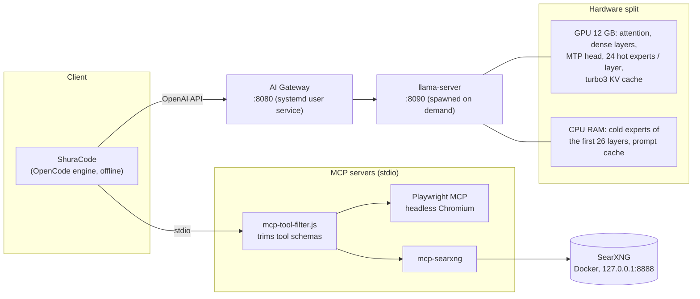
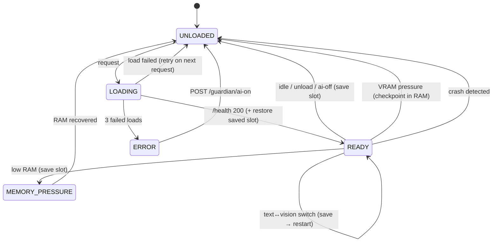

# Architecture

## Overview

## The gateway

[`gateway/ai_gateway.py`](../gateway/ai_gateway.py) is a standard-library-only Python reverse proxy.
It speaks the llama-server/OpenAI API on port 8080 and owns the llama-server process on port 8090.
It is a Linux rewrite of an earlier PowerShell "resource guardian".

| Responsibility | How |
|---|---|
| Load on demand | The first request starts llama-server and waits for `/health`; nothing uses RAM/VRAM until needed. |
| Text ↔ vision switching | The request body is inspected before forwarding. Any `image_url` / `"type": "image…"` part restarts the server with `--mmproj` and `visionOverrides` (fewer expert-cache slots to make room for the projector). |
| Idle unload | After `idleUnloadSeconds` (default 30 min) with no requests, the model is unloaded. |
| Memory-pressure guard | `MemAvailable` from `/proc/meminfo` below `ramFreeMinGB` for 3 polls unloads the model. A generation in flight is never interrupted. Reloading requires `ramFreeMinGBToLoad`, which stops load/unload thrashing. |
| VRAM pressure (opt-in) | `vramGuard` defaults off. Sustained pressure notifies during an active session; unloading requires 90 seconds without requests, or an emergency after the answer ends. The session is saved to tmpfs. |
| Crash recovery | An unexpected exit is detected by the monitor thread; the next request reloads. Three failed loads in a row → `ERROR` until `ai-on`. |
| Agent compatibility | Rewrites the agent engine's camelCase `reasoningEffort` to `reasoning_effort`. Without this, the reasoning-effort variants (fast … max) are silently ignored by llama-server. |
| Streaming | Responses without `Content-Length` (SSE) are re-chunked and flushed as they arrive. Client disconnect closes the upstream socket, which aborts generation. |

### State machine

### Control endpoints

| Endpoint | Effect |
|---|---|
| `GET /guardian/status` | JSON: state, mode, RAM/VRAM headroom, idle time, last error, `vram_pressure`, `last_yield_reason`, `last_yield_at`, `ram_session_saved`, `vram_reload_min_gb` |
| `POST /guardian/unload` | Save slot and unload now; the next request reloads |
| `POST /guardian/ai-off` · `ai-on` | Persistent manual disable / re-enable (also clears `ERROR`) |
| `POST /guardian/multimedia-lock` · `unlock` | Free the GPU for another job (e.g. Whisper) and block loads meanwhile |

Every other path is proxied to llama-server unchanged (including its web UI at `/`).

### Yielding VRAM to the desktop (experimental, off by default)

`vramGuard: false` runs the preserved original gateway entrypoint. Existing installations do not
activate the guard when the new code is installed. Enabling it needs operator approval after isolated
validation. The live binary and model launch configuration are unchanged by this feature.

When enabled, the monitor samples card free VRAM once per second. Five consecutive seconds below
120 MiB activate pressure. An active session receives a notification and a status flag, without
unloading. Idle means **90 seconds with no requests**, measured from completion of the last request;
5–20 second tool pauses never trigger a pressure unload. A genuine emergency is below 60 MiB for ten
consecutive seconds. It can unload an active session only **after the current answer ends**. Recovery
before that cancels the pending unload. Request admission and yield use the same lifecycle lock.

Before unloading, the gateway saves one checkpoint into private, user-owned tmpfs with atomic renames.
Its SHA-256, byte size, token count and model/configuration signature are checked before restore. The
RAM checkpoint and metadata are removed immediately after successful restoration. Short sessions are
also protected. Ordinary idle/manual/shutdown saves retain the existing disk-save policy; pressure
saves never fall back to SSD. No periodic slot saves are added.

If RAM is unavailable or a save fails, pressure only notifies and keeps the live session. An emergency
may unload without a checkpoint and explicitly reports that the prompt will be read again. Bad GPU
telemetry cancels pressure timers and uses the original lifecycle. A failed/corrupt/stale restore is
never forwarded: the backend is restarted once with an empty session, and the next request refills it.
The older disk session is skipped for that recovery. Every fallback has a log event and status counter.

Reload waits at most 30 seconds, releasing the lifecycle lock between checks, then returns 503 if
memory is still unavailable. It requires the measured model-process footprint plus at least 250 MiB,
or the original minimum if larger. Without process telemetry it uses the pre-load headroom. No
background reload occurs. A save has a ten-second timeout; process termination waits ten seconds then
five seconds after killing the **owned PID**. A failed stop keeps the live PID/status visible.

After gateway restart, a compatible checkpoint is recovered; interrupted and invalid private files
are removed. A RAM ownership lease identifies the server by UID, PID, process start time and command
hash. A surviving busy server is left alone until its answer ends. Only an idle matching server can be
stopped; a reused PID is never signalled. An occupied backend port blocks a second server.

`/guardian/status` reports pressure, emergency, last event, counters, fallback, checkpoint availability,
reload threshold and monitor health/liveness. `shura status` shows those fields in plain words. Monitor
exceptions are caught and reported; later ticks retry instead of silently losing the thread.

| Guardian setting | Default | Purpose |
|---|---:|---|
| `vramGuard` | false | Kill switch; off runs the preserved original entrypoint. |
| `vramIdleSeconds` | 90 | Silence after a request before pressure can unload. |
| `vramFreeCriticalMiB` | 120 | Card free VRAM threshold. |
| `vramPressureSeconds` | 5 | Consecutive seconds below pressure threshold. |
| `vramEmergencyMiB` | 60 | Emergency threshold. |
| `vramEmergencySeconds` | 10 | Consecutive seconds below emergency threshold. |
| `vramReloadWaitSeconds` | 30 | Maximum request wait before 503. |
| `vramPressureSlotDir` | `/dev/shm` | Existing tmpfs parent; private per-state directory. |
| `vramPressureSlotReserveMiB` | 512 | Minimum tmpfs free space and RAM above `ramFreeMinGB`; the 187k slot is about 1.25 GiB. |

After an approved deployment, rollback is one operator command from the repository root:
`python3 scripts/rollback_gateway.py --config-dir config`. It waits up to 90 seconds for the active
answer, gates new requests, backs up the guardian config, atomically disables `vramGuard`, restarts
only the existing user service, and restores the prior manual on/off setting. A failed restart restores
the original config and retries the service. This command has offline tests and has **not** been run
against the live service. Part A preserves the original gateway source in `_gateway_legacy.py` and does
not replace the llama-server binary. Before a later binary deployment, a verified binary backup and
its rollback step must be added.

The revised guard has offline fault tests. **GPU validation and acceptance are pending.** The earlier
prototype passed interleaved speed/quality checks but hit the zram growth stop before final 9/9 after
restore; those results do not accept the revised implementation. See
[benchmark notes](BENCHMARKS.md#gateway-vram-guard-partial-validation).

No periodic metrics are written to disk. Emergency slot bytes and metadata stay in RAM (0 GB/day of
SSD checkpoint writes), including after gateway restart. Transition/error messages use the existing
journal logger, so logging is not literally zero-write. Two hardware yields measured 250 bytes total
for their new event lines: 100 yields/day add about 12.5 KB (0.0000125 GB/day); a pathological
yield every 5 seconds adds about 2.16 MB/day (0.00216 GB/day), excluding existing load/restore
messages. There is no per-second metrics log. The 187k benchmark seed occupied 819,157,096 bytes in RAM.
Normal unload still writes to SSD only above the original token threshold. It now stages in tmpfs and
atomically copies to `slotSaveDir`; the bytes per ordinary disk checkpoint are unchanged.

## KV cache and SSD wear

Re-prefilling a 187k-token session takes about 4.5 minutes, so reusing the KV state matters a lot for
agentic coding. The obvious approach is to dump the slot to disk after every response. That costs
~780 MB per save, and an agent session makes a request per tool call. Estimated against the SSD's
1,600 TBW rating:

| Strategy | Writes/day (heavy use) | Rated endurance consumed |
|---|---:|---|
| Save after every response (hundreds/day at 100-187k tokens) | 135-640 GB | full rating in ~7-30 years |
| Save only when switching sessions | 10-25 GB | negligible |
| **Keep in RAM, save only on model unload (this project)** | a few GB | negligible |

What this stack does:

1. **Session switching happens in RAM.** llama-server's host prompt cache (`--cache-ram 4096`) keeps
   the states of recent conversations; returning to a 187k session re-processes ~19 tokens (1.9 s).
   Context checkpoints (`--ctx-checkpoints`, default 32) let the hybrid Gated-DeltaNet model reuse a
   prefix even though its recurrent state cannot be rewound token by token.
2. **Ordinary unloads may touch disk; VRAM pressure never does.** When the gateway unloads the model (idle, memory pressure,
   manual, shutdown), it saves slot 0 to `slotSaveDir`, and only if it holds at least
   `slotSaveMinTokens` (20k) tokens. Below that size, a fresh prefill takes seconds anyway.
3. **One disk file per mode, atomically replaced each time**, so disk usage is bounded (~0.8 GB). After the next
   load the gateway restores it automatically. If the next request continues that conversation, it
   resumes in ~13 s including model load; if not, the restore costs 0.2 s and is simply discarded.

Caveat: an *identical* repeated prompt cannot reuse a restored slot on this hybrid architecture
(the last token must be re-evaluated and the recurrent state cannot step back). A real continuation
of the conversation works as expected.

## MCP tool trimming

[`mcp/mcp-tool-filter.js`](../mcp/mcp-tool-filter.js) is a transparent stdio proxy that filters an MCP
server's `tools/list` response against an allowlist before the client sees it. Every tool schema sits
in the system prompt of every request, so trimming Playwright from 25 to 14 tools and SearXNG from
4 to 2 saves ~2,850 tokens of prefill per fresh session.
